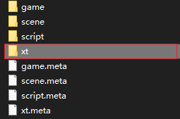
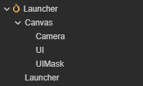

# 安装

## 1.下载仓库

```bash
https://github.com/kaxifakl/XT.git
```

## 2.运行Demo项目

使用CocosDashboard导入XT工程，并使用3.7.3版本打开

运行Launcher场景


# 手动接入XT

如果需要在已有项目中接入XT，以下是接入步骤

## 1.下载仓库

```bash
https://github.com/kaxifakl/XT.git
```

## 2.复制文件夹

将XT/XT/assets/xt文件夹放到自己的项目中



xt文件夹放入项目中时如果编辑器处于打开状态，此时可能会报错xt为空，只需要重新启动编辑器即可

## 3.初始化

在项目的入口脚本中初始化XT

```ts
onLoad() {
    xt.init(); //xt框架初始化
    xt.uiManager.init(); //ui框架初始化
    xt.config.DEFAULT_BUNDLE = 'game'; //设置默认的资源加载bundle
}
```

## 4.UI结构



上图是Demo场景中默认使用的UI结构，其中`Canvas/UI`节点是UI的根节点，`Canvas/UIMask`节点是UI遮罩节点，`Launcher`节点挂载的是启动脚本