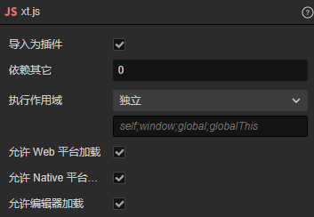
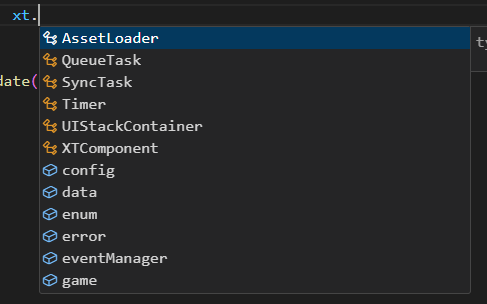

# 全局注入

**XT通过Ts的declare、interface、namespace等特性来实现全局提示与注入**

## xt.js

xt全局文件，通过勾选为插件，来使Cocos最先加载这个脚本，当其他ts文件加载时window.xt存在


## xt.ts

xt提示文件，用于xt代码提示

## 全局注入语法

通过接口，我们可以在任何脚本中补充该接口的属性，这边xt的类型是IXT接口,所以其他任何IXT接口中的属性，都可以在xt下点出来，xt.util也是同样的实现

这样我们就可以用这个方法组建xt空间下的各个模块

```js
declare global {
	const xt: IXT;
	interface IXT{
		util: IUtil
	}
    interface IUtil { }
}

export {}
```
